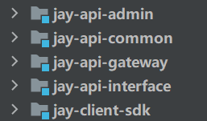

# jay-api-backend

## 项目介绍

这是一个提供API接口供开发者调用的平台前端代码仓库。管理员可以接入并发布接口、统计分析各个接口调用情况；用户可以登录、注册，开通接口调用权限、浏览接口、在线调试，还可以使用客户端SDK轻松在代码中调用接口。

## 项目架构图

## 技术选型

- Spring Boot 框架 
- MySQL 数据库 
- MyBatis-Plus 及 MyBatis X 自动生成CRUD代码插件 
- API 签名认证（Http 调用） 
- Spring Boot Starter（SDK 开发）
-  Dubbo 分布式（RPC、Nacos） 
- Spring Cloud Gateway 微服务网关 
- Swagger + Knife4j 接口文档生成
-  Hutool、Apache Common Utils、Gson 等工具库

## 启动后端项目

项目分为5个子模块：

- jay-api-admin:核心业务后端，负责完成用户管理，接口管理，接口在线调用等功能。
- jay-api-common: 公共模块，包含各其他模块中需要复用的方法、工具类、实体类、全局异常等。
- jay-api-gateway:API网关服务，实现路由转发、访问控制、用户鉴权、流量染色，并统一完成登录校验，API签名校验，接口统计以及请求和响应日志的处理。
- jay-api-interface: 提供模拟API接口。
- jay-client-sdk：客户端SDK，封装了对各API接口的调用方法，降低开发者的使用成本。

1. 在application.yml文件中，将redis、mysql、阿里云oss、nacos等配置修改为你自己的。

2. 使用项目中提供的jay_api.sql语句在本地建库建表。

3. 使用命令行启动**nacos、redis**服务。

4. sdkClient、common子项目需要提前使用Maven工具install到本地Maven仓库，在别的项目通过在pom.xml文件中引入jay-client-sdkt和jay-api-common。

5. IDEA启动admin、gateway、interface三个子项目。

项目启动后，后端接口的swagger文档为：http://localhost:8101/api/doc.html#

nacos配置页为：http://localhost:8848/nacos/index.html

## 业务流程介绍

在前端用户调用接口的时候，首先在admin项目中调用对应的invoke方法，校验请求参数、接口id是否存在、是否关闭等，然后获取到当前的登录用户，并从登录用户中查出ak和sk，并以此作为参数创建SDK客户端对象，然后把刚才参数中的uesrRequestParams通过Gson库将JSON字符串反序列化为Java对象。

此时，SDK客户端先将传来的User对象转换为JSON字符串，设置请求参数（accessKey、nonce随机数、请求体body、时间戳、签名sign），其中ak和sk在用户注册的时候分配，使用hutool工具包，将请求发送给gateway网关。

在网关项目中，在过滤器中，先获取请求头的一系列信息包括：请求唯一标识、请求路径、请求方法、请求参数、请求来源地址，并通过获取请求头中特定信息实现流量染色。该部分设置了黑白名单，只允许IP地址为当前服务器的请求通过，然后我们在做鉴权，通过传入的accessKey在数据中找出对应的用户，并对请求时间、随机数等做校验，在通过accessKey查出来的用户，进一步得到该用户对应的secretKey。同时根据得到的path和method对所对应的接口进行查询，判断该接口是否存在，如果不存在，则抛出指定的异常。最后，如果上述校验都没问题，则通过返回结果处理器handleResponse，使用装饰者模式对user_interface_info（用户接口信息表）中的接口剩余调用次数字段进行更新，这样就完成了整个业务流程。

在上面的过程中，我提到了“鉴权、校验、查询用户、查询secretKey”等操作，这些操作对应的代码位于admin项目中，如果我们直接把对数据库的操作代码放在gateway项目中，势必会增加项目的复杂度以及冗余，所以我想到了用Dubbo这样一个RPC框架，通过@EnableDubbo、@DubboReference、@DubboService等注解，配置相应的yml文件，并以Nacos作为RPC服务的注册中心，实现了远程业务代码的调用。

